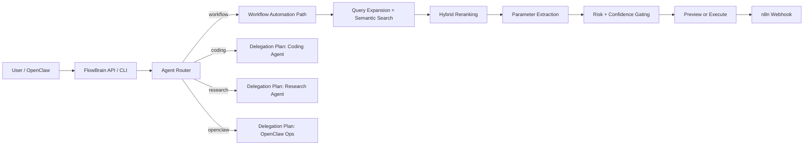

<p align="center">
  
</p>

<p align="center">
  <a href="https://github.com/som3dudeo/flowbrain/actions"></a>
  
  
  
  
</p>

<p align="center">
  
</p>

<p align="center">
  <strong>FlowBrain is the control layer between user intent and real action.</strong><br/>
  It turns OpenClaw into an <strong>agent manager</strong> that can route requests, search workflows, preview risky actions, execute safe automations, and fall back to structured delegation plans when autonomy would be fake.
</p>

<p align="center">
  <a href="#quick-start"><strong>Quick Start</strong></a> •
  <a href="#why-flowbrain-hits-different"><strong>Why it hits different</strong></a> •
  <a href="#see-it-in-10-seconds"><strong>See it in 10 seconds</strong></a> •
  <a href="#trust-safety-and-operations"><strong>Trust & Safety</strong></a> •
  <a href="#http-api"><strong>HTTP API</strong></a> •
  <a href="ARCHITECTURE.md"><strong>Architecture</strong></a> •
  <a href="docs/ROADMAP.md"><strong>Roadmap</strong></a>
</p>

---

## Why FlowBrain hits different

Most automation systems fall into one of two traps:

- they are **too low-level** and force you to think in nodes, webhooks, payloads, and brittle glue
- or they are **too magical** and hide risk, traceability, and control behind a fake “AI agent” story

**FlowBrain sits in the useful middle.**

It gives you:
- **agent routing** for workflow automation, coding, research, and OpenClaw ops
- **semantic workflow search** across 450+ indexed n8n workflows
- **preview-first safety** with confidence gates and risk-aware execution
- **real execution** for workflow paths that are ready to run
- **structured delegation plans** for paths that should not pretend to be autonomous yet
- **auditability** via SQLite state, request tracing, and logs

This is the core product bet:

> The hardest part of agent automation is often not model quality.
> It is deciding whether a request should **execute, preview, delegate, or stop**.

FlowBrain is built around that decision.

---

## See it in 10 seconds

### A normal automation stack says:
- here are 450 workflows
- good luck

### FlowBrain says:
- I understand the request
- I found the most relevant workflow path
- here is what I think will happen
- this action is risky, so I am previewing instead of auto-running
- this request should be delegated, not faked as autonomous

That difference is the entire point.

### Example requests
- “send a Slack message when deploy finishes”
- “find me an n8n workflow for lead enrichment and show me the safest option”
- “post this update publicly” → preview first, because external messaging is risky
- “fix this bug and add tests” → return a coding delegation plan instead of pretending the workflow engine can do it

---

## What it actually does today

### Fully implemented
- Route intents to the best agent with `/route`
- Manage end-to-end workflow automation with `/manage`
- Search workflows semantically with hybrid reranking
- Preview actions before execution
- Execute workflow automations when confidence and safety rules allow it
- Protect deployed instances with optional API-key auth and rate limiting
- Persist previews, runs, and doctor checks in SQLite

### Intentionally partial
- Coding, research, and OpenClaw orchestration currently return a **structured delegation plan**, not autonomous execution
- That means FlowBrain is already a real **agent manager layer**, but only the **workflow automation path** is fully auto-executable right now

That boundary is intentional.

FlowBrain is designed to be **honest about execution maturity** instead of faking universal autonomy.

---

## Architecture at a glance



Read the locked design decisions in [ARCHITECTURE.md](ARCHITECTURE.md).

---

## Safety model

FlowBrain is deliberately conservative.

- **localhost by default** — binds to `127.0.0.1`
- **preview-first** — actions are not executed unless explicitly requested or allowed by policy
- **confidence-gated** — low-confidence matches do not auto-run
- **risk-aware** — external messaging and high-risk actions are blocked from blind execution
- **traceable** — previews and runs are recorded in SQLite
- **hardenable** — optional API key auth, rate limiting, and request tracing middleware are built in

If a system touches the outside world, “looks plausible” is not good enough.

---

## Quick start

Requires **Python 3.10+** and **git**.

```bash
git clone https://github.com/som3dudeo/flowbrain.git ~/Documents/flowbrain
cd ~/Documents/flowbrain
bash bootstrap.sh
```

Or install remotely:

```bash
curl -fsSL https://raw.githubusercontent.com/som3dudeo/flowbrain/main/install.sh | bash
```

Then start it:

```bash
cd ~/Documents/flowbrain
source venv/bin/activate
python -m flowbrain start
```

Check health:

```bash
curl -s http://127.0.0.1:8001/status
```

### The fastest first win

Do this before wiring any live webhook:

```bash
curl -s -X POST http://127.0.0.1:8001/preview \
  -H "Content-Type: application/json" \
  -d '{"intent":"send a slack message when deploy finishes"}'
```

You should get:
- a matched workflow
- confidence and risk fields
- a `decision`
- a `next_step`

Then inspect local evidence:

```bash
curl -s http://127.0.0.1:8001/metrics
python -m flowbrain status
```

For the short version, see [docs/QUICKSTART.md](docs/QUICKSTART.md).

---

## CLI

All commands run through `python -m flowbrain <command>`.

| Command | What it does |
|---|---|
| `flowbrain install` | Install deps, download workflows, build the index, run doctor |
| `flowbrain doctor` | Run health checks |
| `flowbrain start` | Start the API server |
| `flowbrain status` | Show workflow count, agents, and runtime health |
| `flowbrain agents` | List registered agents |
| `flowbrain route "..."` | Show which agent would handle a request and why |
| `flowbrain search "..."` | Search workflow matches |
| `flowbrain preview "..."` | Preview a workflow action with no side effects |
| `flowbrain run "..."` | Execute a workflow path when allowed |
| `flowbrain reindex` | Rebuild the vector index |
| `flowbrain logs` | Show run / preview history |

---

## Trust, safety, and operations

If you're evaluating whether this thing is actually safe and honest, start here:

- [docs/SECURITY.md](docs/SECURITY.md) — security posture and deployment guidance
- [docs/PRIVACY.md](docs/PRIVACY.md) — what is stored locally and what may leave the machine
- [docs/OPERATIONS.md](docs/OPERATIONS.md) — failure modes, fallback paths, and observability
- [docs/EVALUATION.md](docs/EVALUATION.md) — what `/metrics` means and what it does not mean
- [docs/ROADMAP.md](docs/ROADMAP.md) — where this goes beyond n8n
- [docs/AGENTDISCUSS_RESPONSE.md](docs/AGENTDISCUSS_RESPONSE.md) — summary of this v2 pass

## HTTP API

| Endpoint | Method | Purpose |
|---|---|---|
| `/status` | GET | Health, version, workflows indexed, security status, observability summary |
| `/metrics` | GET | Local preview-vs-execute outcome counters from SQLite state |
| `/agents` | GET | Registered agents and capabilities |
| `/route` | POST | Route an intent to the best agent |
| `/manage` | POST | Main agent-manager entrypoint |
| `/search` | POST | Raw semantic workflow search |
| `/preview` | POST | Safe preview of workflow execution |
| `/auto` | POST | Search + extract + gate + optional execute |
| `/execute` | POST | Fire a configured workflow webhook directly |
| `/docs` | GET | FastAPI docs |

### Example: route a request

```bash
curl -s -X POST http://127.0.0.1:8001/route \
  -H "Content-Type: application/json" \
  -d '{"intent":"fix this repo bug and add tests"}'
```

### Example: manage a workflow request

```bash
curl -s -X POST http://127.0.0.1:8001/manage \
  -H "Content-Type: application/json" \
  -d '{"intent":"send a slack message when the deploy finishes","auto_execute":false}'
```

### Example: preview before execution

```bash
curl -s -X POST http://127.0.0.1:8001/preview \
  -H "Content-Type: application/json" \
  -d '{"intent":"post a public update to Slack about the deployment"}'
```

---

## Where FlowBrain belongs in the stack

FlowBrain is strongest today as:
- a **serious local / team tool**
- an **OpenClaw companion service**
- a **public beta** for agent-routed workflow automation
- a **policy-aware orchestration layer** around external execution

It is **not** pretending to be:
- a universal replacement for every coding/research/runtime agent
- a low-latency hot-path execution engine for specialized systems
- a magical “do anything safely” wrapper

That clarity is part of the product.

---

## Repo structure

```text
flowbrain/
  agents/         registry, routing, delegation plans
  cli/            command-line interface
  config/         config loader
  diagnostics/    doctor checks
  middleware/     auth, rate limit, tracing
  policies/       risk, preview, confidence gating
  state/          sqlite persistence
server.py         FastAPI app + web UI
router.py         semantic search engine
reranker.py       hybrid reranking logic
embedding.py      transformer + fallback embeddings
auto_executor.py  workflow execution path
bootstrap.sh      zero-to-running setup
INTEGRATION.md    OpenClaw integration guide
ARCHITECTURE.md   design decisions and system model
```

---

## OpenClaw integration

FlowBrain plugs into OpenClaw through the `n8n-flows` skill.

See:
- [INTEGRATION.md](INTEGRATION.md)
- [ARCHITECTURE.md](ARCHITECTURE.md)

---

## Release status

**Current state:** polished public beta / serious early launch  
**Version line:** `2.6.x` repo era, with stronger onboarding, trust docs, and local runtime outcome metrics live

If you want to audit the release trail, historical audits are kept out of the repo root under [`docs/audits/`](docs/audits/) and [`_deprecated/`](_deprecated/).

---

## License

MIT
e

MIT
