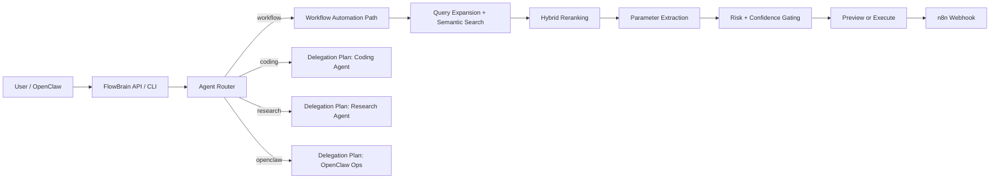

<p align="center">
  
</p>

<p align="center">
  <a href="https://github.com/som3dudeo/flowbrain/actions"></a>
  
  
  
  
</p>

<p align="center">
  
</p>

<p align="center"><strong>FlowBrain turns OpenClaw into an agent manager.</strong><br/>It understands a request, routes it to the right execution path, safely previews risky workflow actions, and can execute real n8n automations when allowed.</p>

---

## Why FlowBrain exists

Most automation tools stop at one of two bad extremes:
- they are **too low-level** and force you to think in webhooks, nodes, and payloads
- or they are **too magical** and hide safety, traceability, and control

FlowBrain sits in the useful middle.

It gives you:
- **agent routing** for workflow automation, coding, research, and OpenClaw orchestration
- **semantic workflow search** across 450+ indexed n8n workflows
- **preview-first safety** with confidence gates and risk classification
- **real execution** for workflow paths through n8n webhooks
- **structured delegation plans** for non-workflow agent types
- **auditability** via SQLite state and request tracing

## What it actually does today

### Fully implemented
- Route intents to the best agent with `/route`
- Manage end-to-end workflow automation with `/manage`
- Search workflows semantically with hybrid reranking
- Preview actions before execution
- Execute workflow automations when confidence and safety rules allow it
- Protect deployed instances with optional API-key auth and rate limiting

### Intentionally partial
- Coding, research, and OpenClaw orchestration currently return a **structured delegation plan**, not autonomous execution.
- That means FlowBrain is already a real **agent manager layer**, but only the **workflow automation path** is fully auto-executable right now.

That distinction is important, and it’s by design.

---

## Architecture at a glance



## Safety model

FlowBrain is deliberately conservative.

- **localhost by default** — binds to `127.0.0.1`
- **preview-first** — workflow actions are not executed unless explicitly requested
- **confidence-gated** — low-confidence matches do not auto-run
- **risk-aware** — external messaging / high-risk actions are blocked from automatic execution
- **traceable** — previews and runs are recorded in SQLite
- **hardenable** — optional API key auth, rate limiting, and request tracing middleware are built in

---

## Quick start

Requires **Python 3.10+** and **git**.

```bash
git clone https://github.com/som3dudeo/flowbrain.git ~/Documents/flowbrain
cd ~/Documents/flowbrain
bash bootstrap.sh
```

Or install remotely:

```bash
curl -fsSL https://raw.githubusercontent.com/som3dudeo/flowbrain/main/install.sh | bash
```

Then start it:

```bash
cd ~/Documents/flowbrain
source venv/bin/activate
python -m flowbrain start
```

---

## CLI

All commands run through `python -m flowbrain <command>`.

| Command | What it does |
|---|---|
| `flowbrain install` | Install deps, download workflows, build the index, run doctor |
| `flowbrain doctor` | Run health checks |
| `flowbrain start` | Start the API server |
| `flowbrain status` | Show workflow count, agents, and runtime health |
| `flowbrain agents` | List registered agents |
| `flowbrain route "..."` | Show which agent would handle a request and why |
| `flowbrain search "..."` | Search workflow matches |
| `flowbrain preview "..."` | Preview a workflow action with no side effects |
| `flowbrain run "..."` | Execute a workflow path when allowed |
| `flowbrain reindex` | Rebuild the vector index |
| `flowbrain logs` | Show run / preview history |

---

## HTTP API

| Endpoint | Method | Purpose |
|---|---|---|
| `/status` | GET | Health, version, workflows indexed, security status |
| `/agents` | GET | Registered agents and capabilities |
| `/route` | POST | Route an intent to the best agent |
| `/manage` | POST | Main agent-manager entrypoint |
| `/search` | POST | Raw semantic workflow search |
| `/preview` | POST | Safe preview of workflow execution |
| `/auto` | POST | Search + extract + gate + optional execute |
| `/execute` | POST | Fire a configured workflow webhook directly |
| `/docs` | GET | FastAPI docs |

### Example: route a request

```bash
curl -s -X POST http://127.0.0.1:8001/route \
  -H "Content-Type: application/json" \
  -d '{"intent":"fix this repo bug and add tests"}'
```

### Example: manage a workflow request

```bash
curl -s -X POST http://127.0.0.1:8001/manage \
  -H "Content-Type: application/json" \
  -d '{"intent":"send a slack message when the deploy finishes","auto_execute":false}'
```

---

## Deployment notes

FlowBrain is strongest today as:
- a **serious local / team tool**
- an **OpenClaw companion service**
- a **public beta** for agent-routed workflow automation

Before calling it true large-scale production infrastructure, you should still plan for:
- API authentication in deployed environments
- rate limiting and monitoring
- load testing under concurrency
- externalized session / queue layers if you move beyond single-node local usage

---

## Repo structure

```text
flowbrain/
  agents/         registry, routing, delegation plans
  cli/            command-line interface
  config/         config loader
  diagnostics/    doctor checks
  middleware/     auth, rate limit, tracing
  policies/       risk, preview, confidence gating
  state/          sqlite persistence
server.py         FastAPI app + web UI
router.py         semantic search engine
reranker.py       hybrid reranking logic
embedding.py      transformer + fallback embeddings
auto_executor.py  workflow execution path
bootstrap.sh      zero-to-running setup
INTEGRATION.md    OpenClaw integration guide
ARCHITECTURE.md   design decisions and system model
```

---

## OpenClaw integration

FlowBrain plugs into OpenClaw through the `n8n-flows` skill.

See:
- [`INTEGRATION.md`](INTEGRATION.md)
- [`SKILL.md`](SKILL.md)
- [`ARCHITECTURE.md`](ARCHITECTURE.md)

---

## Release status

**Current state:** polished public beta / serious early launch  
**Version line:** `2.5.x` repo era, with agent-manager routing, middleware hardening, and workflow execution path live

If you want to audit the release trail, historical audits are kept out of the repo root under [`docs/audits/`](docs/audits/) and [`_deprecated/`](_deprecated/).

---

## License

MIT
